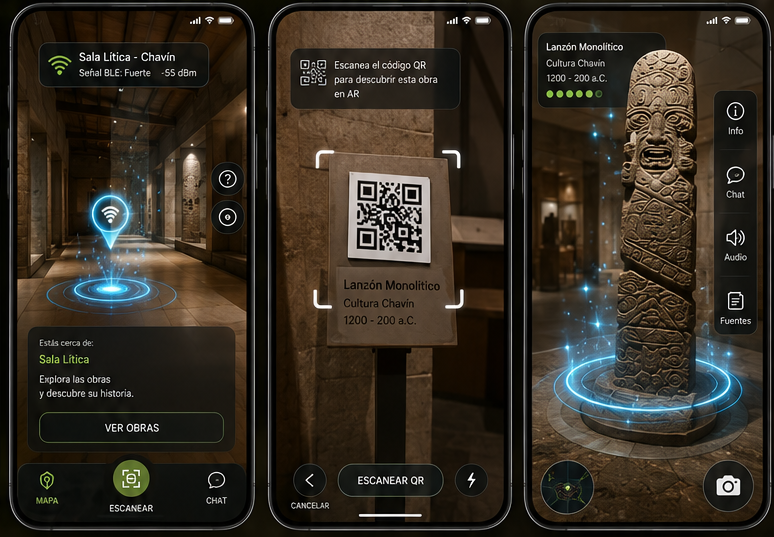

<p align="center">
    <a href="http://eduardoguev.me/Tesis/" target="_blank">http://eduardoguev.me/Tesis/</a>
</p>


<p align="center">
    
</p>

<p align="center">
    
</p>

<h1 align="center">museiqApp · MuseIQ</h1>

<p align="center">
    Guía móvil contextual para museos que combina <strong>BLE</strong>, <strong>voz</strong> e <strong>IA</strong> para acompañar al visitante en tiempo real.
</p>

<p align="center">
    
    
    
    
    
    
</p>

# MuseIQ

> Guía móvil contextual e inmersiva para museos, con experiencia AR-first apoyada por BLE, QR, voz, MuseRAG e imágenes.

MuseIQ está evolucionando desde una guía conversacional tradicional hacia una experiencia de mediación cultural centrada en la cámara o vista AR. La pantalla principal ya no se organiza como una app de tabs, sino como una visita inmersiva con controles flotantes, bottom sheets y paneles secundarios cuando el visitante necesita más detalle.

## Fuente de verdad del flujo

- `README.md`: visión general y flujo visible del producto.
- `ROADMAP.md`: prioridades activas y cobertura por estados del recorrido.
- `README-DEV.md`: setup técnico, integración con MuseRAG y operación local.

Si las referencias visuales de `pantallas/` no están presentes en tu copia del repo, toma como fuente de verdad las rutas de `app/` y la cobertura documentada en este README y en `ROADMAP.md`.

## Enfoque actual

- La cámara o fondo AR es el centro de la visita.
- BLE detecta sala o zona y resume el estado en el HUD.
- Explorar sala y Escanear QR son acciones flotantes, no tabs.
- En `ar-activo`, `Audio` vive como acción lateral superior y abre un bottom sheet.
- Las preguntas se abren como modal inferior, no como pantalla independiente.
- El detalle de obra se simplifica a `Detalles` e `Imagenes`.
- El color principal es el azul MuseIQ `#1689CE`.

## Flujo implementado

1. Inicio con fondo inmersivo y logo MuseIQ.
2. Selección de museo.
3. Preparación de visita con permisos y requisitos.
4. Home AR sin sala detectada.
5. Home AR con sala detectada.
6. Sugerencia BLE futura, expresada como hipótesis y con confirmación por QR.
7. Explorar sala como bottom sheet con obras, imágenes y badges de recurso.
8. Escanear QR como overlay de cámara con marco de lectura, cancelar y linterna.
9. Obra identificada tras QR simulado.
10. Detalle de obra con ficha, acciones AR/chat e imágenes relacionadas.
11. Galería de imágenes relacionadas.
12. Cargando AR, AR activo temporal y hotspot seleccionado.
13. Chat IA como modal inferior y audio/QR como sheets dentro de `ar-activo`.
14. AR no disponible con fallback a visor 3D.

## Flujo real en rutas

Secuencia principal actual:

`index` -> `seleccionar-museo` -> `preparacion-visita` -> `/(drawer)/home`

Ramas desde Home:

- `Explorar` -> bottom sheet de sala -> `artwork-detail` -> `artwork-images`
- `Escanear QR` -> overlay simulado -> `obra-identificada`
- `Preguntar` -> `pregunta-voz-modal`
- `Ver en AR` -> `cargando-ar` -> `ar-activo` -> `ar-hotspot-seleccionado`
- Dentro de `ar-activo`: `Audio` -> bottom sheet, `Escanear QR` -> bottom sheet, `Preguntar IA` -> modal inferior
- Fallback AR -> `ar-no-disponible` -> `visor-3d`

## Cobertura contra `pantallas/flujo.png`

El flujo visual completo incluye mas pantallas que el MVP actual. La cobertura real queda asi:

- Cubierto: `1 Inicio`, `2 Seleccionar museo`, `3 Preparacion de visita`, `4 Home AR sin sala`, `5 Home AR sala detectada`, `6/13 Sugerencia BLE futura`, `7 Explorar sala`, `8 Escanear QR` como overlay simulado en Home y como sheet contextual en `ar-activo`, `9 Obra identificada`, `A Detalles de la obra`, `B Imagenes relacionadas`, `R Cargando AR`, `10 AR activo`, `11 Hotspot seleccionado`, `12 Chat IA` como modal inferior, `9 Audio activo` como sheet contextual y pantalla dedicada legada, `V AR no disponible`, `U Visor 3D sin AR`, `Q Permisos`, `P Sin conexion`, `S Error de conexion`, `X Resultado de QR invalido`, entrada manual de codigo QR, `J Menu drawer` compacto, `H Idioma` desde Configuracion, `K Perfil del visitante` desde el encabezado, `L Cambiar museo`, `M Configuracion`, `N Ayuda`, `O Modo tecnico` y cierre de sesion.
- Parcial: `W Modelo 3D no disponible`. El visor 3D y el fallback de AR existen, pero falta una pantalla dedicada para el estado de modelo no disponible.
- Faltante: `T Actualizacion` y pantalla dedicada completa de `W Modelo 3D no disponible`.

## Pantallas implementadas (carpeta `app/`)

Listado de pantallas detectadas en `app/` y su correspondencia con el flujo:

- `splash.tsx`: Splash legado de logo / carga
- `seleccionar-museo.tsx`: Selección de museo
- `preparacion-visita.tsx`: Preparación de visita y permisos
- `permissions-modal.tsx`: Modal de permisos integrado desde la preparación
- `index.tsx`: Pantalla inicial principal del flujo
- `_layout.tsx`: Orquestación de rutas
- `(drawer)/home.tsx`: Home AR con estados de sala, sugerencia BLE, explorar sala y QR simulado
- `(drawer)/info-recorrido.tsx`: Exploración por salas y obras fuera del HUD principal, alineada al estilo oscuro del flujo
- `(drawer)/perfil.tsx`: Perfil del visitante y resumen de actividad
- `(drawer)/mis-visitas.tsx`: Ruta interna oculta; ya no aparece como opcion del drawer
- `(drawer)/favoritos.tsx`: Ruta interna oculta; ya no aparece como opcion del drawer
- `(drawer)/historial.tsx`: Ruta interna oculta; ya no aparece como opcion del drawer
- `(drawer)/cambiar-museo.tsx`: Cambio de museo desde el drawer, alineado a la referencia visual
- `(drawer)/idioma.tsx`: Selección de idioma base
- `(drawer)/ayuda.tsx`: Ayuda con buscador, temas frecuentes, guias rapidas y contacto
- `(drawer)/ajustes.tsx`: Configuración agrupada por experiencia, conectividad, preferencias y soporte
- `(drawer)/debug.tsx`: Modo técnico con estado del sistema, dispositivo y herramientas de desarrollo
- `ar-no-disponible.tsx`: AR no disponible / fallback a visor 3D
- `qr-invalido.tsx`: Resultado de QR inválido con reintento y entrada manual
- `codigo-manual.tsx`: Ingreso manual de código QR y mapping local a obra
- `sin-conexion.tsx`: Estado sin conexión para continuar con contenido offline
- `error-conexion.tsx`: Estado de error MuseRAG/backend con reintento
- `ar-activo.tsx`: Home AR - AR activo
- `ar-audio-activo.tsx`: Pantalla legada de audio activo; el flujo principal actual usa sheet dentro de `ar-activo`
- `ar-chat-ia.tsx`: Vista AR del flujo de preguntar
- `obra-identificada.tsx`: Pantalla que muestra obra identificada
- `artwork-detail.tsx`: Detalle de obra simplificado (tabs de Detalles e Imagenes)
- `artwork-images.tsx`: Galería / imágenes relacionadas
- `cargando-ar.tsx`: Indicador de carga de AR
- `visor-3d.tsx`: Visor 3D (sin integrar AR completo)
- `ar-hotspot-seleccionado.tsx`: Hotspot seleccionado (estado)
- `pregunta-voz-modal.tsx`: Modal inferior de preguntas con voz prioritaria, markdown y fuentes

## Pantallas o funcionalidades pendientes

- QR real con cámara, parsing y mapping a obra.
- Estado de resiliencia: Actualización disponible.
- Detección automática de conectividad para abrir Sin conexión/Error de conexión sin depender de una acción manual.
- Estado dedicado de Modelo 3D no disponible.
- Sincronización de idioma, museo seleccionado, favoritos y actividad local con backend.
- Descarga y renderizado final de modelos 3D por obra en AR.


## Capacidades conservadas

- Detección BLE de sala o zona.
- Exploración manual de salas y obras.
- Chat con MuseRAG por texto.
- Preguntas por voz y narración con TTS/STT.
- Contexto de museo, sala, obra y modo de respuesta.
- Imágenes relacionadas y fuentes visuales.
- Progreso local y analítica básica.
- Modo técnico con BLE, sensores y depuración.

## Arquitectura visual reciente

- `features/home/screens/home-screen.tsx`: Home AR como ruta fina con HUD superior/inferior separados.
- `features/home/components/`: HUD, explorar sala y escena central del Home.
- `components/museiq/home/`: overlay QR reutilizable y componentes visuales compartidos del Home.
- `components/museiq/ar-flow.tsx`: HUD compartido de AR, side rail y modelo 3D reutilizable.
- `hooks/use-home-ble-status.ts`: estado BLE resumido para Home AR.
- `features/chat/hooks/use-artwork-chat-controller.ts`: controlador compartido para chat, RAG y voz.

## Stack tecnológico

| Capa | Tecnología |
| --- | --- |
| UI móvil | Expo Router, React Native, TypeScript |
| Navegación | Stack, Drawer, rutas modales |
| Conectividad | `react-native-ble-plx`, `expo-sensors` |
| Voz | `expo-speech`, `expo-speech-recognition` |
| Persistencia | `expo-sqlite` |
| IA | MuseRAG |

## Comandos útiles

```bash
npm install
npx tsc --noEmit
npm run lint
npm run dev:client
```

## Estado actual

La base AR-first ya está montada para el flujo visual principal y para las pantallas auxiliares del drawer. El drawer actual queda deliberadamente compacto: Inicio, Explorar salas, Cambiar museo, Configuracion, Ayuda, Modo tecnico, Perfil desde el encabezado e Idioma desde Configuracion. `Mis visitas`, `Favoritos` e `Historial` se conservan como rutas internas ocultas, pero ya no saturan el menu.

El Home fue depurado para dejar solo las acciones esenciales del HUD: menu, nombre de sala, audio, explorar, preguntar y QR. `Preguntar` ahora abre un modal que sube desde abajo, prioriza la interacción por voz y renderiza la respuesta en Markdown.

En `ar-activo`, la experiencia tambien se simplificó: boton de retroceso superior izquierdo, accion `Audio` superior derecha, `Preguntar IA` como CTA principal inferior y `Escanear QR` como sheet contextual para saltar a otra obra sin abandonar la escena.

`obra-identificada` tambien se simplificó: boton de retroceso superior izquierdo, `Audio` superior derecho, card central mas grande y un unico CTA horizontal de `Ver en AR`.

El reconocimiento automatico de obra por BLE queda deliberadamente para el final; por ahora BLE detecta sala y prepara sugerencias futuras. El QR real, AR real y carga de modelos 3D son las próximas integraciones fuertes.

## Documentación relacionada

- Configuración técnica: [README-DEV.md](README-DEV.md)
- Roadmap de producto y flujo: [ROADMAP.md](ROADMAP.md)
- URL de backend: [app.config.js](app.config.js)
- Cliente de MuseRAG: [lib/muserag-api.ts](lib/muserag-api.ts)
