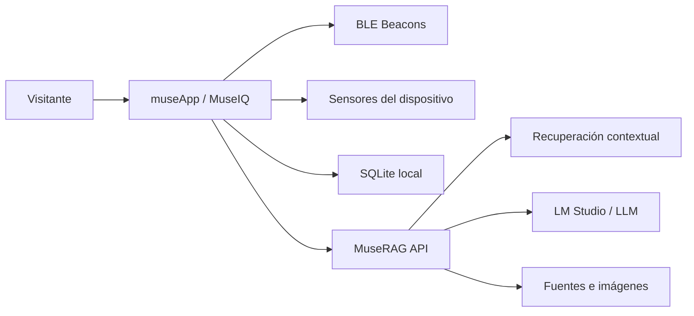

<p align="center">
  
</p>

<p align="center">
  
</p>

<h1 align="center">museApp · MuseIQ</h1>

<p align="center">
  Guía móvil contextual para museos que combina <strong>BLE</strong>, <strong>voz</strong> e <strong>IA</strong> para acompañar al visitante en tiempo real.
</p>

<p align="center">
  
  
  
  
  
  
</p>

## Qué es este proyecto

`museApp` es el cliente móvil de **MuseIQ**, una experiencia guiada para recorridos de museo donde la app entiende el contexto físico del visitante y responde preguntas sobre la obra activa con texto, voz e imágenes de apoyo.

No es solo un chat con IA: el proyecto conecta recorrido, proximidad, narrativa, accesibilidad y contenido curado en una sola experiencia mobile.

## Qué hace la app

- Detecta contexto de sala mediante beacons BLE.
- Permite explorar salas y obras manualmente cuando no hay sensor disponible.
- Abre preguntas por texto o voz sobre la obra activa.
- Consume respuestas de `MuseRAG` con contexto de museo, sala, obra y modo de respuesta.
- Ofrece tres estilos de respuesta: `Breve`, `Explicada` y `Para niños`.
- Reproduce narración en voz alta y resalta el texto mientras se lee.
- Muestra imágenes fuente y referencias visuales relacionadas con la respuesta.
- Mantiene estado local de la visita, progreso y analíticas básicas.
- Incluye panel de depuración para BLE, brújula, acelerómetro y conteo de pasos.

## Por qué destaca en portafolio

- Convierte IA en una funcionalidad de producto real, no en una demo aislada.
- Integra contexto físico con software móvil: proximidad, sensores y navegación situacional.
- Resuelve una experiencia multimodal completa: texto, voz, visuales y memoria local.
- Muestra arquitectura separada entre app móvil y backend RAG especializado.

## Arquitectura general



## Stack

| Capa | Tecnología |
| --- | --- |
| App móvil | Expo Router, React Native, TypeScript |
| Contexto físico | `react-native-ble-plx`, `expo-sensors` |
| Voz | `expo-speech`, `expo-speech-recognition` |
| Estado local | `expo-sqlite` |
| Backend IA | [MuseRAG](https://github.com/eduardo202020/museRAG) |

## Flujo de experiencia

1. El visitante entra al recorrido y la app detecta sala o zona mediante BLE.
2. `museApp` selecciona la obra actual o permite cambiarla manualmente.
3. El usuario pregunta por texto o por voz.
4. La app envía la consulta a `MuseRAG` con contexto enriquecido.
5. La respuesta vuelve con texto, metadatos y, cuando aplica, fuentes visuales.
6. El visitante puede leer, escuchar, profundizar o continuar el recorrido.

## Ejecución local

1. Instala dependencias:

```bash
npm install
```

2. Crea tu archivo `.env`:

```env
EXPO_PUBLIC_MUSERAG_URL=http://192.168.1.10:8000
```

3. Inicia la app:

```bash
npm run dev
```

Comandos útiles:

- `npm run android`
- `npm run ios`
- `npm run web`
- `npm run dev:client`

## Repos y documentación relacionada

- Backend RAG: [eduardo202020/museRAG](https://github.com/eduardo202020/museRAG)
- Guía técnica de desarrollo: [README-DEV.md](README-DEV.md)
- Cliente de integración con IA: [lib/muserag-api.ts](lib/muserag-api.ts)
- Estado principal de la visita: [providers/museiq-provider.tsx](providers/museiq-provider.tsx)

## Estado actual

El proyecto ya cubre el flujo principal del MVP: recorrido contextual, selección de obra, consulta multimodal y respuesta asistida por IA. Está preparado para demos funcionales, pruebas de sala y evolución hacia una experiencia de mediación cultural más completa.
